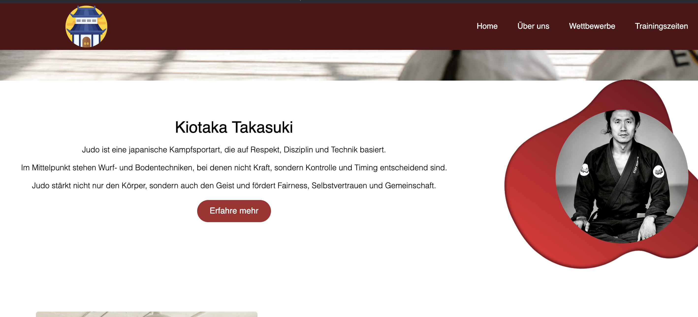
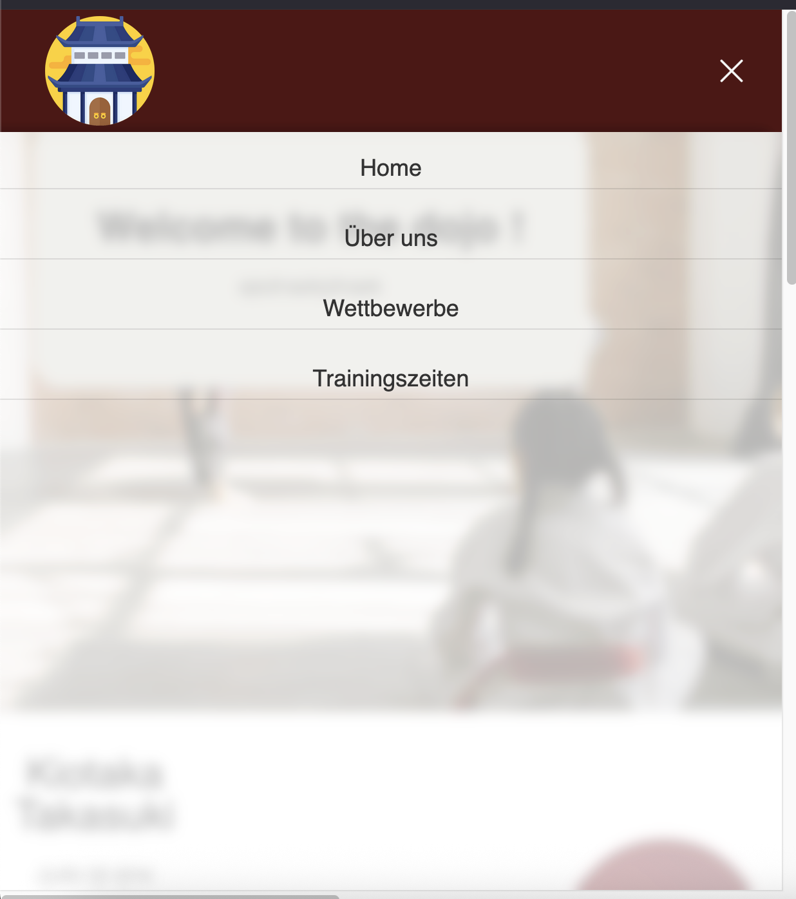
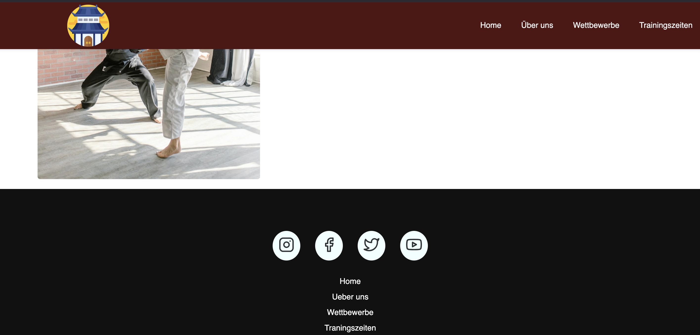

# Judo-Dojo 🥋

Ein modernes, responsives Frontend für einen Judo Dojo, gebaut mit React. Dieses Projekt dient als Grundlage für eine zukünftige Fullstack-Anwendung mit dem MERN-Stack (MongoDB, Express, React, Node.js).

  
---

## Projektübersicht

Ein professionelles Webdesign für einen Judo Dojo, das moderne Webtechnologien mit traditioneller Kampfkunst vereint. Die Anwendung bietet ein responsives Design, intuitive Navigation und eine ansprechende Benutzeroberfläche.

## 🚀 Features
- **Interactive UI** built with React
- **Smooth animations** and modern styling  
- **Simple FrontPage** 

---

## 🛠️ Tech Stack

### Frontent

- **React18** – Moderne UI-Bibliothek
- **CSS3** – Styling, Layout, Animationen
- **hamburger-react** – interaktives Hambuger-Menü
- **FeatherIcons** – schöne skalierbaren Icons

### Geplant (Futre Implementation)
- **node.js & express** – Backend-Server
- **MongoDB** – Datenbank
- **REST API** -Datenkommunikation

---

## 📸 Screenshots

